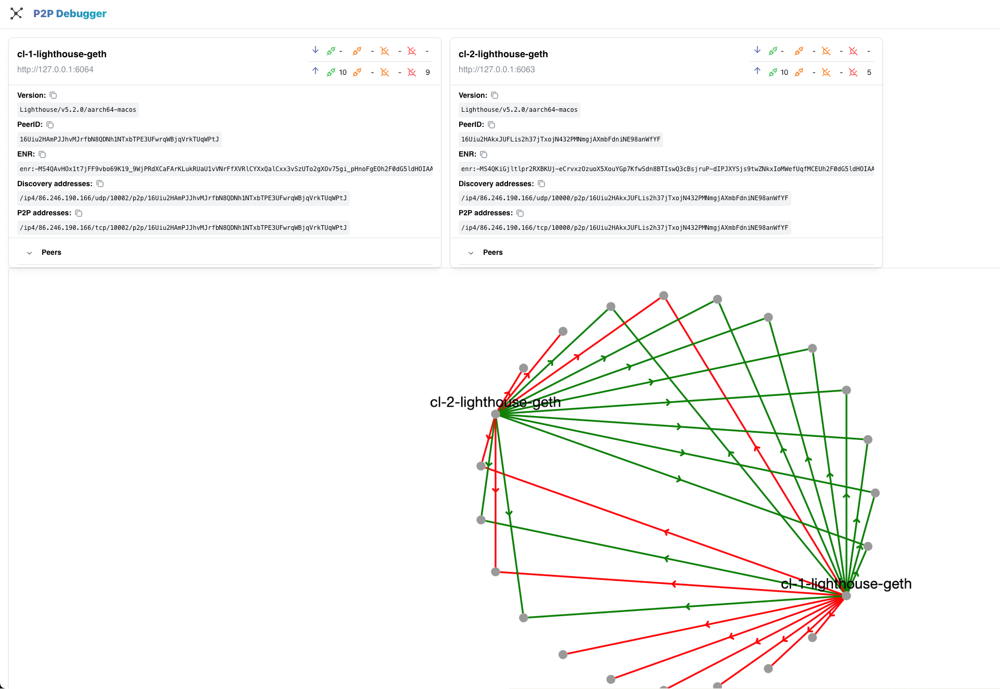

# P2P Debugger

Simple web client to help debugging Ethereum consensus p2p network.

## Usage

1. Copy `config.example.json` to `config.json` and fill values.
2. Run with docker `docker run --name p2p-debugger -v /path/to/config.json:usr/share/nginx/html/config.json -p 8080:80 maxdavin/p2p-debugger:latest`
3. Open [http://localhost:8080](http://localhost:8080)

## Screenshot



## FAQ

> The page does not load because of CORS errors

If the consensus client is running on localhost, you might need to specify Allow origin header; i.e add `--http-allow-origin "http://localhost:8080"` to cli arguments.

## Dev

```
git clone https://github.com/MaximeDavin/p2p-debugger.git
cd p2p-debugger
cp config.example.json public/config.json // Fill values
npm install --include=dev
npm run dev
```
